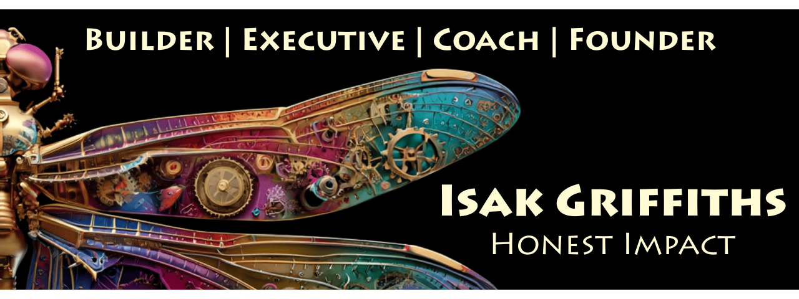

<picture>
  <source media="(prefers-color-scheme: dark)" srcset="hero-dark.svg">
  <source media="(prefers-color-scheme: light)" srcset="hero-light.svg">
  
</picture>

# Isak Griffiths

**Two production AI systems. Paying clients. Real architecture deep-dives.**

Built WhiteSpaceIQ and TryIt-AI in 90 days after more than 15 years away.
The gap wasn't a liability. It was leverage. And perspective.

---

## Production Systems

### [WhiteSpaceIQ](https://github.com/HonestImpact/whitespaceiq-mvp) — Competitive Intelligence Automation
**Production | Paying Client | 40+ Page Strategic Audits**
Multi-agent system with "foundation lock" pattern—Phase 1 locks after approval, guaranteeing voice consistency across 22 LLM prompts. RAG-powered (pgvector), self-evaluating quality thresholds. Client feedback: *"Jaw. Dropped."*
**Stack**: FastAPI • LangGraph • PostgreSQL + pgvector • Next.js • Docker
[Architecture deep-dive →](https://github.com/HonestImpact/whitespaceiq-mvp/blob/main/README.support/AGENTIC_ARCHITECTURE.md)

### [TryIt-AI (Noah)](https://github.com/HonestImpact/TryItAIagentic/tree/feat/agentic-refactor) — Trust-First AI for Skeptics
**Production | Scale-to-Zero on Koyeb**
Multi-agent orchestration with metacognitive self-evaluation. Dual search strategy (FTS + vector similarity) in single PostgreSQL database. Transparent reasoning, not just results. Built for people who see through the hype.
**Stack**: Next.js 15 • LangGraph • PostgreSQL + pgvector • Supabase • TypeScript
[Trust architecture →](https://github.com/HonestImpact/TryItAIagentic/blob/feat/agentic-refactor/README.md)

---

## Dual Fluency: Why This Works

**1990s-2008**: Oracle DBA • Mission-critical systems • Air Force-trained by SAC Headquarters programmers • Telecom, billing, university library systems • International projects

**2008-2024**: Executive coach and leader • 30+ person teams • $2M–$7M budgets • Government, nonprofit, military, private sectors

**2025**: Back to code • Two production systems in 90 days • Paying clients • Leadership + systems thinking + technical execution

---

## What I'm Building

**Technical Writing** (coming soon):
- From 15+ Year Hiatus to Production AI: What the Gap Taught Me
- Multi-Agent Architecture: Lessons from Production
- Building AI for Skeptics: A Trust-First Architecture
- RAG at Scale: Practical Patterns for Competitive Intelligence

**Open Source** (coming soon):
- Foundation Lock Pattern (TypeScript) — Prevent content drift in multi-prompt LLM workflows
- Metacognitive Evaluation Service (TypeScript) — Self-evaluation layer for LLM outputs
- Trust-Building UI Patterns (React + TypeScript) — Show reasoning, not just results
- Dual RAG Pipeline (Python) — Keyword + semantic search with intelligent routing

**Machine Soul Language** (releasing soon on Spotify):
Three songs created in collaboration with AI about the return to code, trust in AI, and building what others don't see yet.

---

## Philosophy

**Compassion ~ Candor ~ Clarity**. Technology serves dignity. No hype, no clever complexity. Simple solutions beat clever ones. This isn't abstract—it's embedded in the code: Noah's trust-first architecture, WhiteSpaceIQ's locked foundation, human-machine collaboration as partners.

---

## Tech Stack

**Design**: Figma • Kittl • Midjourney • Recraft
**Development**: Python • TypeScript • Next.js • FastAPI • PostgreSQL • Supabase
**AI/ML**: LangChain • LangGraph • Claude • OpenAI • Autonomous Agents • RAG • Vector Databases
**Deployment**: Koyeb • Render • Replit • Vercel • Docker
**Legacy Expertise**: Oracle • Mission-Critical Systems • Database Architecture

---

## Let's Connect

**LinkedIn**: [Isak Griffiths](https://www.linkedin.com/in/honestimpact)
**Email**: [Contact through Honest Impact](https://honestimpact.com)
**Philosophy**: [Lead with Soul. Succeed with Strategy.](https://thedragonflydynamic.com)

---

> "The gap gave me clarity. The combination is rare. The results are real."

---

**Last Updated**: November 2025
**Current Projects**: 2 systems in production, 4 open source components in development
**Status**: Building in public, shipping with soul

