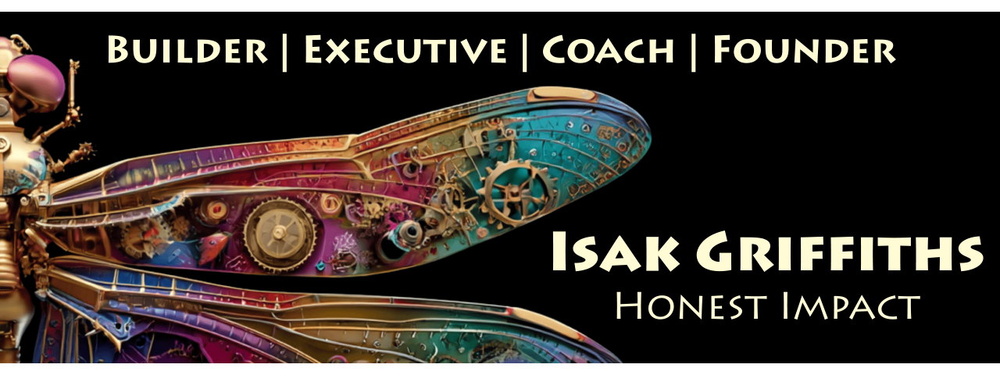

<picture>
  <source media="(prefers-color-scheme: dark)" srcset="hero-dark.svg">
  <source media="(prefers-color-scheme: light)" srcset="hero-light.svg">
  
</picture>

# Isak Griffiths

**I build production AI systems — and run my own business on one.**

The engineer and the executive. Most organizations don't fail at AI because the
technology is wrong; they fail because nobody in the room understands the
systems, the processes, and the people at once. That's the gap I work in.

---

## Production systems

### [Something They Don't See](https://somethingtheydontsee.com/) — Competitive intelligence, automated
Multi-agent research platform producing deep market analysis and custom reporting
for paying clients. Agent graph over a scheduled ingestion pipeline, with
multi-provider LLM routing and fallback so a single vendor outage doesn't stop a run.
**Stack**: FastAPI • LangGraph + LangChain • PostgreSQL (asyncpg + Alembic) • MCP server • APScheduler • Anthropic / OpenAI / Gemini • Docker

### [TryIt-AI (Noah)](https://tryitai.koyeb.app/) — Trust-first AI for skeptics
Multi-agent orchestration with metacognitive self-evaluation. Dual retrieval —
full-text search and vector similarity in a single PostgreSQL database — so
answers are grounded and the reasoning is visible. Built for people who see
through the hype.
**Stack**: Next.js 15 • LangGraph • PostgreSQL + pgvector • Supabase • TypeScript
[Code and trust architecture →](https://github.com/HonestImpact/TryItAIagentic/tree/feat/agentic-refactor)

### [Versus Recon](https://versusrecon.com/) — Competitive intel for content
Five automated workflows ingest competitor channels daily, detect signals humans
miss, and deliver a tactical brief every Monday.
**Stack**: n8n orchestration • Supabase • YouTube Data API • React

---

## Tools

### [FlipItFile](https://flipitfile.com/) — On-device file conversion
Free converters that run entirely in the browser. No accounts, no uploads, no
watermarks — the file never leaves your machine. Heavy decoding runs off the main
thread in Web Workers.
**Stack**: Astro • Tailwind v4 • TypeScript • WebAssembly + Web Workers • ffmpeg.wasm • jSquash • pdf-lib / pdf.js • Canvas API

### [Sidekick Chats](https://sidekickchats.com/) — Persistent AI personas
Conversational personas that hold context across sessions instead of starting cold
every time.

### [Management Micro Tools](https://honestimpact.com/micro-tools.html) — Seven utilities for the work of managing
Small, single-purpose tools for the moments management actually gets hard —
Decision Debt Identifier, Feedback Flinch Neutralizer, Meeting Filter, and four
more. Static front end over n8n webhooks.

---

## The operating system underneath

I run my own business on an AI operating system I built — the same architecture I
help others think through. Layered agents with real boundaries: delegated
authority over the *how*, the load-bearing decisions still mine. Capability is
not authority, and a system that forgets that is a liability, not an assistant.

---

## Also

**Two EPs, made in collaboration with AI** — *Machine Soul Language* and
*Always Been (Choose Your Groove)*, both on my artist profile. Creative proof
that AI and human expression aren't opposites.
[Listen on Apple Music →](https://music.apple.com/us/artist/isak-griffiths/1850884735) ·
[The Machine Soul Language experience →](https://honestimpact.com/portfolio.html)

---

## Philosophy

**Compassion · Candor · Clarity**. Technology serves dignity. No hype, no clever
complexity — simple solutions beat clever ones. It's embedded in the code: Noah's
trust-first architecture, human and machine as partners.

---

## Tech stack

**Development**: Python • TypeScript • Next.js • Astro • FastAPI • PostgreSQL • Supabase
**AI/ML**: LangChain • LangGraph • MCP • Claude • OpenAI • Gemini • RAG • Vector databases • Autonomous agents
**Automation**: n8n • Workflow orchestration • Scheduled pipelines
**Frontend/Edge**: WebAssembly • Web Workers • Tailwind
**Deployment**: Koyeb • Render • Vercel • Cloudflare • Docker
**Foundations**: Oracle • Mission-critical systems • Database architecture

---

## Let's connect

**Site**: [honestimpact.com](https://honestimpact.com) · [Work with me](https://honestimpact.com/offers.html) · [Speaking](https://honestimpact.com/speaking.html) · [Field Notes](https://honestimpact.com/field-notes.html)
**AI & Automation**: [aaaDragonfly](https://aaadragonfly.com)
**LinkedIn**: [Isak Griffiths](https://www.linkedin.com/in/honestimpact)
